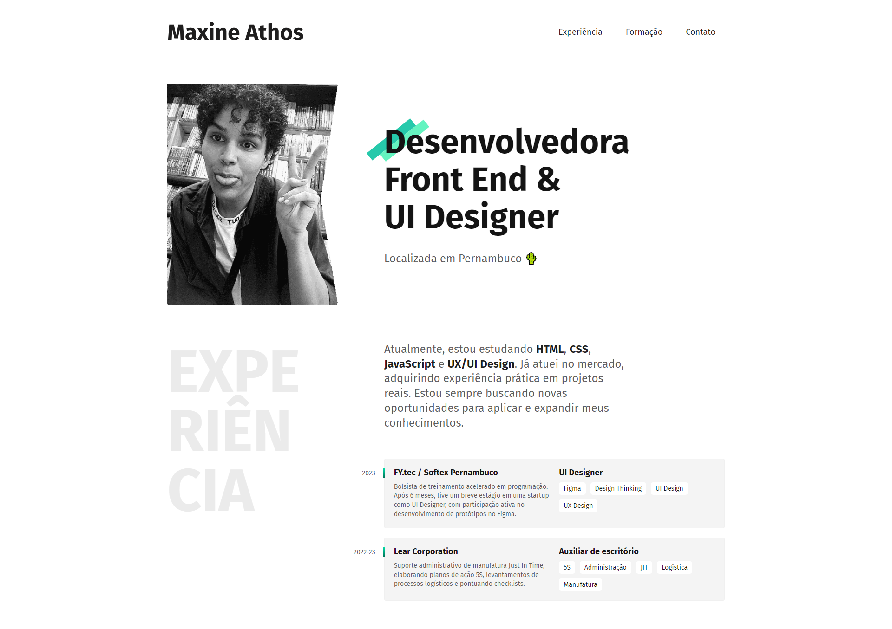
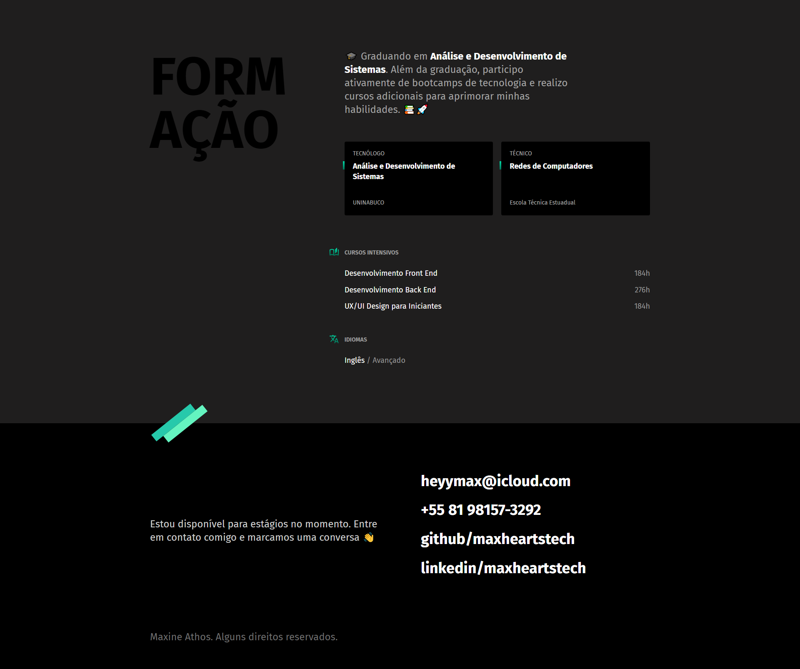

# Maxine Athos - Desenvolvedora e Designer

Bem-vindo ao repositório do meu site-currículo, um projeto desenvolvido como parte do meu progresso de aprendizagem de HTML e CSS. Este site foi construído para destacar minha trajetória, experiências e habilidades.

## Visualização

Você pode visualizar o site online acessando [maxhearts.github.io](https://maxhearts.github.io).

## Screenshots

Aqui estão algumas capturas de tela do site:

### Tela Inicial e Seção de Experiência

*Tela inicial e seção de experiência do site.*

### Formação e Contato

*Seção de formação e informações de contato.*

## Tecnologias Utilizadas

Este projeto utiliza as seguintes tecnologias:

- **HTML (HyperText Markup Language)**:
  - Estrutura o conteúdo do site, incluindo seções, cabeçalhos, parágrafos e links.
  - Utiliza elementos semânticos para melhorar a acessibilidade e a organização do conteúdo.

- **CSS (Cascading Style Sheets)**:
  - Estiliza o conteúdo HTML para criar um layout visualmente atraente e responsivo.
  - Inclui regras para cores, fontes, espaçamentos e posicionamento dos elementos.
  - Utiliza técnicas como `flexbox` e `grid layout` para garantir um design responsivo e ajustável a diferentes tamanhos de tela.
  - Estiliza o site com fontes importadas do Google Fonts, como Fira Sans, e define estilos de responsividade para melhorar a experiência do usuário em dispositivos móveis.

## Recursos Adicionais

Para mais informações sobre o projeto e atualizações, visite os seguintes links:

- [LinkedIn](https://linkedin.com/in/maxheartstech)
- [GitHub](https://github.com/maxheartstech)

## Contato

Para entrar em contato ou discutir oportunidades, envie um e-mail para [heyymax@icloud.com](mailto:heyymax@icloud.com) ou uma mensagem via [WhatsApp](https://wa.me/5581981573292).

---

**Maxine Athos**  
Desenvolvedora Front End & UI Designer  
Alguns direitos reservados.
